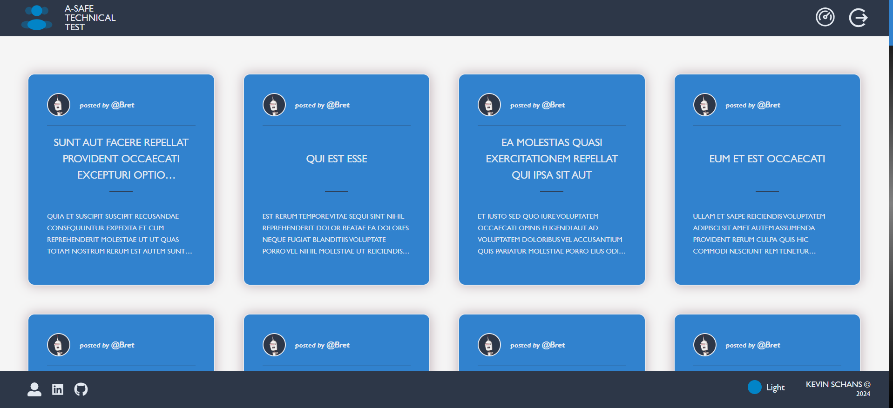
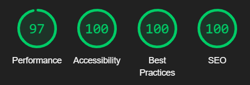

# A-SAFE DIGITAL Technical Test

## NextJS / ReactTS / Redux / TailwindCSS

 

  

 

    This APP has been developed to connect to multiple API's, obtaining and displaying user
    information. The design of its architecture follows the principles of Clean Architecture
    and Screaming Architecture, ensuring a clear separation of responsibilities, modularity
    and scalability.

 
 

# Index

 

## Lighthouse results

  

 

## Features

    ✔️ Display of data across key entities: Users, Posts and Customers

    ✔️ Authentication with NextAuth, including secure sign-in, log-out and protected routes

    ✔️ Secure dashboard with statistics, client management and user data

    ✔️ Customizable theme system with Light, Dark and Solarized options

    ✔️ Error handling service with custom errors for precise issue detection

    ✔️ Dynamic user feedback with SweetAlert2

    ✔️ Fully responsive design, optimized for accessibility and SEO performance

 

## Technologies and Tools used

   
    
    
    
     
     
    
    
   
   

 

## Contribution

If you want to contribute to this project, follow these steps:

1. Perform a fork to the repository.

2. Create a branch for your feature or bugfix: `git checkout -b feature/your-feature-name`

3. Make the necessary changes and commits: `git commit -m 'Add some feature'`

4. Push to branch: `git push origin feature/your-feature-name`

5. Send a pull request to the original repository.

 

## Project Status

 

## Project Developer

| [ Kevin Schans](https://github.com/KevinVanDerSchans) |
| :--------------------------------------------------------------------------------------------------------------------------------------------: |
